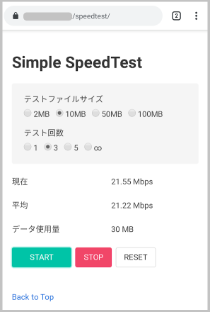

# simple-network-speed

## これは何？

ネットワーク速度を測定する超シンプルなウェブアプリです。

ウェブアプリと言ってもただのHTMLとJavaScriptなので、適当なWEBサーバーでホストして、クライアントからWEBブラウザでアクセスするだけで使えます。Chrome推奨、IEでは動かないかもしれません。

※ 今の所ダウンロードのみの対応です


## 機能

- テストファイルのサイズを2MB～100MBで変更
- テスト回数を1回～無限で変更
- ダウンロード速度平均を表示
- テストの中断
- テスト中の設定変更（サイズ・回数）


## 使い方

app内のファイルをnginxやApacheなどのドキュメントフォルダに入れ、クライアントからindex.htmlにアクセスします。テストファイルのサイズとテスト回数を選択して、STARTボタンを押すと測定が始まります。


## ダミーファイルの作り方

テスト用のファイルはPowerShellのコマンドで作成するのが簡単です。

PowerShell

```powershell
fsutil file createnew <filename> <byte>
```

例：10MBの`10MB.file`を作成

```powershell
fsutil file createnew 10MB.file 10485760
```


## Licence

MIT Licenceで公開します。ご自由にお使いください。